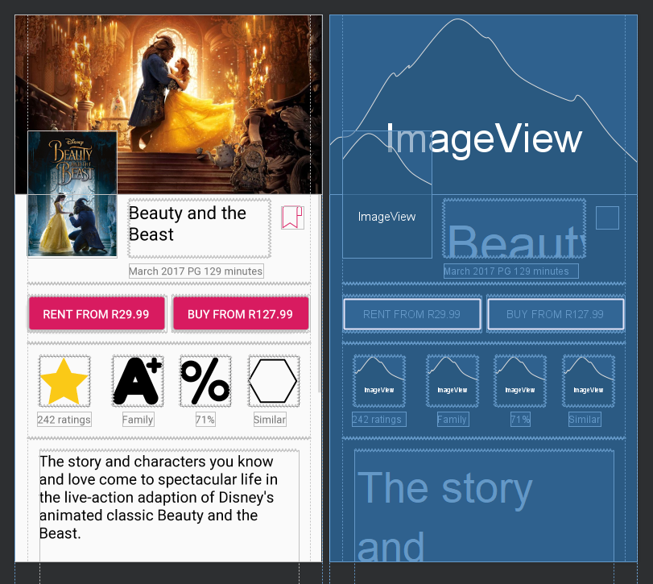

# Android XML Layout

I will write android xml file in this repository. because I want to share with everyone. I will try to write xml as simple as possible. because my english skill is not good. but I believe it will be better more and more. 

## constraint layout

| Project name | memo | image |
|:--------:|:--------:|:--------:|
| [Constraint layout sample](ConstraintLayout_Study/) | I have referred to [this site](https://riggaroo.co.za/constraintlayout-guidelines-barriers-chains-groups/) |  |
